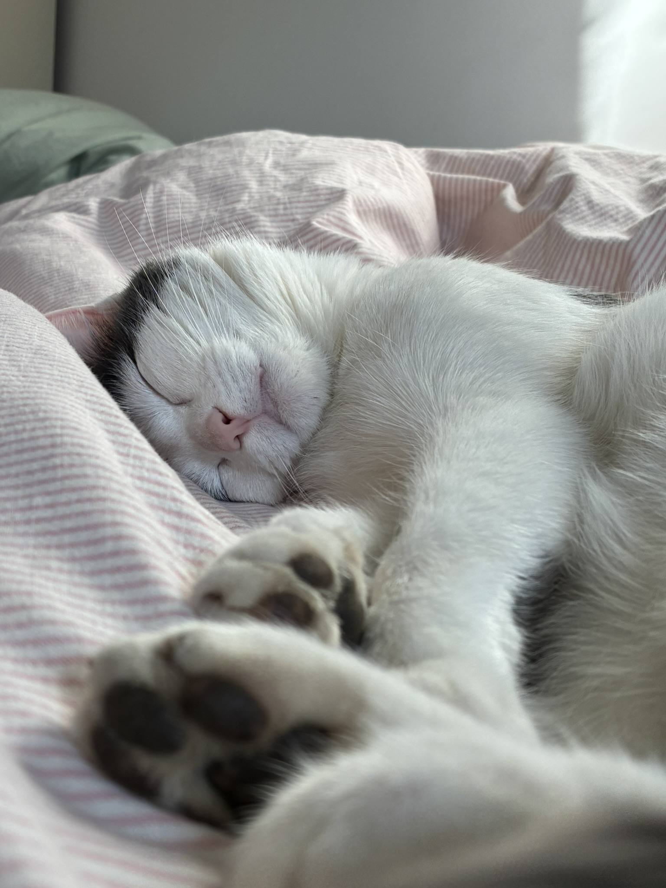

# Pet Project (literaly)

### Goal

Creating a cat flap to only open when (1) a cat does not have a foreign object (e.g. mouse, bird) in their mouth and (2) when the RFID chip is detected

### Why?

Why not...?

### Technologies To Use:

- Python
- Raspberry Pi
- RFID Scanner

### Work still in progress but here's a picture of this bonafide killer:

